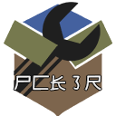

  

# pck3r :

This program created for novice in linux   and can handle almost things in ubuntu and all distributions  based on  debian(package manager : "apt")...
the pcker project , started by amzy0(M.Amin azimi.K) and you can change Pck3r under GPL3 license ...
you can send me a pull request in github : https://github.com/amzy-0/pck3r and features will be added soon ...
good luck...

# logo :

    尸⼕长㇌尺

# GUI logo :

# about pck3r :

    -----------------------------------------
    |                                       |
    | pck3r : It is a versatile program and |
    |                                       |
    | you avoid using useless commands and  |
    |                                       |
    | it is written for Ubuntu...           |
    |                                       |
    -----------------------------------------

# system wide installation :

*for system wide installation :*

$ ./installer.py

# pck3r commands

"install" command :

    $ pck3r install "somthing" :
    {
        nodejs,
        wine,
        ohmyzsh,
        flstudio,
        minecraft,
        or ...
    }
    
"uninstall" command :

    $ pck3r uninstall "somthing" :
    {
        minecraft
    }

"clear" command :

    $ pck3r clear:
    {clear your terminal }

"sys" command :

    $ pck3r sys update
    (update your oprating system)

    $ pck3r sys upgrade
    (upgrade your oprating system)

    $ pck3r sys updgr
    (both, update and upgrade (full upgrade))

"tilix" command :

    $ pck3r tilix
    (tilix terminal ...)

"dotnet" command :

    $ pck3r install dotnet
    (installing .NET (dot net ) C0RE, ASP, MCS compiler , ...)    

"pkg" command :

    $ pck3r pkg <package name>"
    (search for packages ...)"

"update" command :

    $ pck3r update
    (update to last release from github.com/amzy-0/pck3r)

"minecraft" command :

    $ pck3r minecraft
    (minecraft runner)

"version" command :

    $ pck3r version
    (this command show pck3r version)

